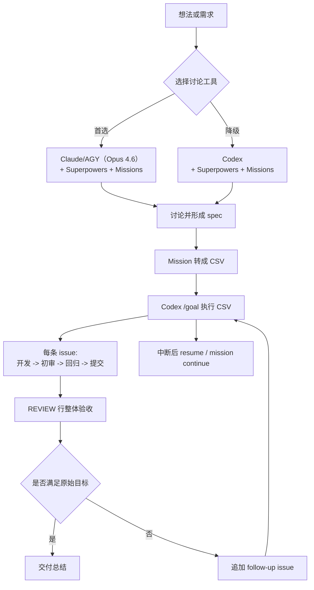

# 长、大任务 Infra 建设教程（第二版）

> 版本：2026-06-14  
> 基于第一版（2026-06-06）修订  
> 核心目标：让 Agent 不只"跑得久"，而是能在长任务里保持上下文、边界、验收和恢复能力。  
> 一句话架构：Graphify 管记忆，Superpowers 管工程方法和边界，Missions 管任务拆解与 CSV 状态闭环，Claude/AGY 管讨论与设计，Codex `/goal` 管长时间执行和恢复。

这套 Infra 适合几小时到跨天的开发任务，例如大重构、复杂功能、多模块迁移、前后端联调、文档和代码同步改造。它不追求把 Agent 变成完全无人监督的黑箱，而是把"可执行任务"、"验收证据"、"中断恢复"和"最终复审"固化下来，让长任务的风险可控。

## 第二版主要变更

| 变更项 | 第一版 | 第二版 |
| --- | --- | --- |
| 讨论方案主力 | 未明确指定，泛指 Claude Code 或 Codex | **Claude/AGY（Claude Opus 4.6 模型）** 搭配 Superpowers + Missions 插件 |
| 讨论方案降级 | 无 | **Codex** 搭配 Superpowers + Missions 插件 |
| 方法层 | Agent Skills + Superpowers | **仅 Superpowers**，移除 Agent Skills |
| 核心项目数 | 三个（Graphify、Agent Skills/Superpowers、Missions） | **两个**（Graphify、Superpowers）+ Missions 执行层 |

## 先验配置：权限与风险

长任务最容易卡在两个地方：

1. 环境层面：Agent 每次写文件、跑命令、联网或访问目录都要反复请求批准。
2. 决策层面：Agent 不知道什么时候该继续、什么时候该停、什么时候必须验证。

权限配置只能解决第一层；第二层要靠后面的 Graphify、Superpowers、Missions 和 CSV 闭环解决。

### Claude/AGY 权限配置

Claude/AGY 作为讨论方案的主力工具，权限配置取决于具体客户端：

**Antigravity CLI（AGY）：**

配置文件通常在：

```text
~/.gemini/config/settings.json
```

AGY 的权限模型以 permission grants 为基础，可以通过交互式授权或配置文件预授权。对于长任务讨论阶段，建议至少授予：

- 项目目录的读写权限
- 常用命令（git、npm、python 等）的执行权限
- 插件（Superpowers、Missions）的完整访问

**Claude Code：**

```text
~/.claude/settings.json
```

确保 Superpowers 和 Missions 插件已安装并启用。Claude Code 的权限粒度较细，可以按项目目录和工具分别授权。

### Codex 配置（降级方案 & 执行层）

Codex 的用户级配置文件通常在：

```text
Windows: %USERPROFILE%\.codex\config.toml
macOS / Linux: ~/.codex/config.toml
```

如果你的目标是让 Codex 在可信项目里长时间自动执行，可以写入：

```toml
approval_policy = "never"
sandbox_mode = "danger-full-access"
```

含义：

| 配置 | 作用 | 风险 |
| --- | --- | --- |
| `approval_policy = "never"` | 非交互执行，不弹审批 | Agent 误判时不会被人类审批拦住 |
| `sandbox_mode = "danger-full-access"` | 关闭沙箱，允许访问本机文件和网络 | 等同把本机权限交给 Agent，必须只在可信工作区使用 |

更稳妥的日常默认值是：

```toml
approval_policy = "on-request"
sandbox_mode = "workspace-write"
```

建议做法：

1. 开发长任务前切到 `never + danger-full-access`。
2. 只在已经进入 git 管理、能回滚的工作区使用。
3. 不在含生产密钥、云平台凭证、私有 SSH key 的目录里运行。
4. 长任务结束后改回 `on-request + workspace-write`。

### Codex App 配置

Codex App 可以在设置里调整：

```text
Settings -> Configuration -> User config
```

把 Approval policy 调成 `Never`，Sandbox 调成 `Full access` 或等价选项。开始调时 App 可能出现红色错误提示，通常是配置页面和本地 `config.toml` 刷新状态不同步。处理方式：

1. 先确认 `~/.codex/config.toml` 已经写入目标配置。
2. 重启 Codex App。
3. 重新打开设置页确认实际生效状态。

## 长程任务 Harness

这套 Harness 由四层组成：

| 层 | 工具 | 负责什么 |
| --- | --- | --- |
| 权限层 | Codex config / Claude 权限 | 降低反复审批带来的中断 |
| 记忆层 | Graphify | 把项目变成可查询知识图谱，减少 Agent 盲读和遗忘 |
| 方法层 | Superpowers | 规定不同任务该走什么工程流程 |
| 执行层 | Missions + Codex `/goal` | 把任务拆成 CSV，并按四状态闭环持续执行 |

### 讨论与执行的分工

第二版明确区分了"讨论设计"和"长时间执行"两个阶段，分别由不同工具承担：



### 为什么讨论方案首选 Claude/AGY

| 维度 | Claude/AGY（Opus 4.6） | Codex |
| --- | --- | --- |
| 模型能力 | Claude Opus 4.6，长上下文推理更强 | 依赖当前配置的模型 |
| 交互模式 | 实时对话，适合多轮澄清和设计迭代 | 偏向批量执行，交互深度有限 |
| 插件生态 | Superpowers + Missions 完整支持 | Superpowers + Missions 完整支持 |
| 上下文窗口 | 更大，适合复杂 spec 讨论 | 受限于执行模式 |
| 最佳场景 | brainstorming、spec 编写、方案对比、设计评审 | 长时间无人值守执行、`/goal` 批量任务 |

### 何时降级到 Codex 讨论

以下情况可以直接用 Codex 做讨论：

1. 需求简单明确，不需要多轮澄清。
2. Claude/AGY 不可用（网络、配额、环境限制）。
3. 希望讨论和执行在同一会话里完成。
4. 团队已有成熟 spec 模板，只需填充式讨论。

降级时的注意事项：

- 确保 Codex 已安装 Superpowers 和 Missions 插件。
- 讨论阶段不要直接进入 `/goal`，先完成 spec 再转 CSV。
- 复杂需求宁可分多次讨论，也不要一次塞太多上下文。

## 两个核心项目的定位

### Graphify：记忆层

项目地址：[https://github.com/safishamsi/graphify](https://github.com/safishamsi/graphify)

Graphify 会把代码、文档、SQL、脚本、PDF、图片等材料抽成知识图谱，输出：

```text
graphify-out/
├── graph.html
├── GRAPH_REPORT.md
└── graph.json
```

它解决的是长任务里的"上下文漂移"问题。不要让 Agent 每次都用 `rg` 从零搜一遍，也不要让它凭聊天记录记住全部架构。更好的方式是：

1. 项目开始前先运行 `graphify .`。
2. 大改之后重新运行或更新图谱。
3. 遇到"这个模块从哪里进来"、"这个字段在哪些地方流转"时，先让 Agent 查询 Graphify。

Windows PowerShell 注意：直接运行 `graphify .`，不要运行 `/graphify .`，因为前导斜杠在 PowerShell 里容易被当成路径。

### Superpowers：方法层

项目地址：[https://github.com/obra/superpowers](https://github.com/obra/superpowers)

Superpowers 是第二版唯一的方法层工具，涵盖完整工程工作流：

| 技能类别 | 包含的 Skills | 覆盖场景 |
| --- | --- | --- |
| 需求与设计 | brainstorming、writing-plans | 需求澄清、方案探索、spec 编写、实现计划 |
| 开发 | test-driven-development、subagent-driven-development | TDD、并行子任务开发 |
| 调试 | systematic-debugging | 系统化故障定位和修复 |
| 审查 | requesting-code-review、receiving-code-review | 代码审查的发起和接收 |
| 交付 | verification-before-completion、finishing-a-development-branch | 完成前验证、分支收尾 |
| 执行 | executing-plans、dispatching-parallel-agents | 计划执行、并行任务分发 |
| 工作区 | using-git-worktrees | 隔离工作区管理 |

**第二版不再使用 Agent Skills 的原因：**

1. **职责重叠**：Superpowers 已经覆盖了从需求到交付的完整工程流程，Agent Skills 中的 API 设计、前端工程、安全、性能等技能与 Superpowers 存在大量重叠。
2. **上下文成本**：同时加载两套 skill 集合会显著消耗上下文窗口，降低 Agent 在复杂任务中的推理质量。
3. **维护简化**：单一方法层工具降低了 skill 冲突、版本不一致和配置混乱的风险。
4. **专注原则**：与其用多套 skill 覆盖"所有可能的工程场景"，不如让一套 skill 在"长任务闭环"这个核心目标上做好。

如果某些具体的工程边界能力确实缺失（如特定安全检查、性能基线测试），建议：

- 写成项目级的自定义 AGENTS.md 规则。
- 或在 Superpowers 的 spec / brainstorming 阶段把这些要求显式写入 acceptance_criteria。

### Missions：执行层

项目地址：[https://github.com/flowing-water1/Missions](https://github.com/flowing-water1/Missions)

Missions 是这套长任务 Harness 的执行核心。它把自然语言、已批准文档或已有 CSV 路由到不同任务路径，最后统一进入 `mission-csv-execute`。

常见触发方式：

```text
$mission issues/xxx.csv
$mission docs/superpowers/specs/xxx.md
$mission 给登录页增加手机号验证码登录，包含倒计时和重发逻辑
$mission continue
```

最终执行建议仍然包进 Codex `/goal`：

```text
hello
/goal @issues/xxx.csv
```

先发 `hello` 是一个实用习惯：不要让会话第一条就是 `/goal`。有些环境里第一条 `/goal` 记录在 resume 时不稳定，先用普通消息占位更保险。

## 安装与配置

### 1. 安装 Graphify

Graphify 当前官方包名是 `graphifyy`，命令仍然是 `graphify`。

Windows：

```powershell
winget install --id astral-sh.uv -e
uv tool install "graphifyy[office,chinese]"
graphify install --platform codex
graphify codex install
```

macOS：

```bash
brew install python@3.12 uv
uv tool install "graphifyy[office,chinese]"
graphify install --platform codex
graphify codex install
```

Ubuntu / Debian：

```bash
sudo apt update
sudo apt install -y python3 python3-pip pipx git
curl -LsSf https://astral.sh/uv/install.sh | sh
uv tool install "graphifyy[office,chinese]"
graphify install --platform codex
graphify codex install
```

验证：

```bash
graphify --version
graphify .
```

如果你希望 Graphify 以项目级 skill 进入当前仓库：

```bash
graphify install --project --platform codex
```

注：应该要求 agent 通过脚本等的形式，对 graphify 做分布式管理。

### 2. 安装 Superpowers

#### Claude Code 安装方式

```text
/plugins
```

搜索 `superpowers`，选择安装。

#### AGY（Antigravity）安装方式

Superpowers 通常以插件形式安装：

```text
左侧 Plugins -> Coding -> Superpowers -> 点击 + 安装
```

或通过配置目录手动安装：

```bash
git clone https://github.com/obra/superpowers.git ~/agent-tools/superpowers
mkdir -p ~/.gemini/config/plugins
cp -R ~/agent-tools/superpowers ~/.gemini/config/plugins/
```

#### Codex CLI 安装方式

```text
/plugins
```

搜索 `superpowers`，选择安装。

#### 本地 Skill 兜底方式

如果插件市场不可用，可以用本地 skill 方式兜底：

```bash
git clone https://github.com/obra/superpowers.git ~/agent-tools/superpowers
mkdir -p ~/.agents/skills
cp -R ~/agent-tools/superpowers/skills/* ~/.agents/skills/
```

用户级本地 skills 路径是：

```text
~/.agents/skills
```

一些旧教程或第三方包仍写 `~/.codex/skills`。如果你的 Codex 版本只识别旧路径，可以同时镜像到 `~/.codex/skills`，但注意不要覆盖已有同名 skill。

### 3. 安装 Missions

macOS / Linux：

```bash
git clone https://github.com/flowing-water1/Missions.git ~/agent-tools/Missions
mkdir -p ~/.agents/skills ~/.codex/skills
cp -R ~/agent-tools/Missions/mission* ~/.agents/skills/
cp -R ~/agent-tools/Missions/mission* ~/.codex/skills/
```

Windows PowerShell：

```powershell
$tools = Join-Path $HOME "agent-tools"
$repo = Join-Path $tools "Missions"
New-Item -ItemType Directory -Force $tools | Out-Null
if (-not (Test-Path $repo)) {
  git clone https://github.com/flowing-water1/Missions.git $repo
}

$skillRoots = @(
  (Join-Path $HOME ".agents\skills"),
  (Join-Path $HOME ".codex\skills")
)

foreach ($root in $skillRoots) {
  New-Item -ItemType Directory -Force $root | Out-Null
  Get-ChildItem $repo -Directory -Filter "mission*" | ForEach-Object {
    $target = Join-Path $root $_.Name
    if (-not (Test-Path $target)) {
      Copy-Item $_.FullName $target -Recurse
    }
  }
}
```

完成后应至少看到：

```text
mission/
mission-doc-route/
mission-approved-doc/
mission-csv-execute/
mission-long-task/
mission-recovery/
```

重启 Claude Code / AGY / Codex，让新 skills 被重新扫描。

## 推荐目录结构

在每个项目里保留这几个目录：

```text
docs/
└── superpowers/
    └── specs/
        └── 2026-06-14-xxx-spec.md

issues/
├── 2026-06-14-xxx.csv
└── 2026-06-14-xxx.review.md

.mission/
├── 2026-06-14-临时长任务.csv
└── 2026-06-14-临时长任务.review.md

graphify-out/
├── graph.html
├── GRAPH_REPORT.md
└── graph.json
```

建议：

1. `docs/` 和 `issues/` 可以提交到仓库。
2. `.mission/` 通常作为本地恢复状态，默认不提交，除非团队明确需要共享。
3. `graphify-out/` 是否提交看团队习惯。大型项目建议不提交，或只提交 `GRAPH_REPORT.md`。

## AGENTS.md 最小模板

在仓库根目录放一个 `AGENTS.md`，让 Agent 每次进项目都知道路由。

```markdown
# 项目 Agent 规则

## 工具分工

- 讨论、需求澄清、spec 设计：首选 Claude/AGY（Opus 4.6）+ Superpowers + Missions。
- 降级讨论：Codex + Superpowers + Missions。
- 长时间执行：Codex `/goal @issues/*.csv`。
- 方法层：仅使用 Superpowers，不加载 Agent Skills。

## 工作流路由

- 简单查询、解释、审查：直接回答，不进入长任务流程。
- 新功能、复杂 bug、大重构、跨模块改造：先做需求澄清或 spec，再用 mission 生成 CSV。
- 已有 CSV：使用 mission 执行，长任务使用 Codex `/goal @issues/xxx.csv`。
- 中断恢复：先运行 `$mission continue` 或从最近未完成 CSV 继续。
- 代码库理解：优先查询 Graphify，再补充必要的源码阅读。

## 硬门禁

- 不虚构测试、命令输出、浏览器结果或集成证据。
- 低等级证据不能包装成高等级结论：dry-run 不是真实执行，unit test 不是 E2E。
- 代码变更后必须运行相关验证，并在总结里写明验证命令和结果。
- 不写入密钥，不覆盖用户未授权改动，不运行破坏性命令。

## 长任务完成定义

- 每条 issue 满足 dev_state、review_initial_state、review_regression_state、git_state。
- CSV 末尾 REVIEW 行通过原始目标对齐检查。
- 如果存在无法验证项，必须记录 validation_gap、risk 和人工验收建议。
```

## 从想法到落地的标准流程

### 步骤一：讨论方案（Claude/AGY 主导）

在 Claude/AGY（Claude Opus 4.6 模型）中发起讨论。确保已加载 Superpowers 和 Missions 插件。

**首选路径：Claude/AGY**

```text
# 在 Claude Code 或 AGY 中
请先用 brainstorming 流程，把我的需求整理成 spec，不要写代码。

需求：[描述你的需求]
```

Agent 会自动触发 Superpowers 的 brainstorming skill，按以下流程推进：

1. 探索项目上下文
2. 逐个澄清问题（一次一个问题，优先多选题）
3. 提出 2-3 种方案及推荐
4. 逐段展示设计，获取逐段批准
5. 输出 spec 到 `docs/superpowers/specs/YYYY-MM-DD-topic-design.md`
6. spec 自审 + 用户审阅
7. 衔接 writing-plans skill 写实现计划

适合触发的 Superpowers skills：

```text
brainstorming          → 需求探索与方案设计
writing-plans          → 实现计划编写
test-driven-development → 如果涉及测试策略讨论
```

**降级路径：Codex**

当 Claude/AGY 不可用时：

```text
# 在 Codex 中
请先用 brainstorming 流程讨论需求，输出 spec 到 docs/superpowers/specs/，不要写代码。

需求：[描述你的需求]
```

降级注意事项：

1. Codex 的交互深度有限，复杂需求可能需要更主动地补充上下文。
2. 确保 Superpowers 插件已正确加载（检查 `/plugins` 或 skill 列表）。
3. 如果 brainstorming skill 未自动触发，用 `$brainstorming` 显式调用。

输出物建议放在：

```text
docs/superpowers/specs/YYYY-MM-DD-topic-spec.md
```

不要急着写 plan。复杂任务里，过细的 plan 经常会限制 Agent 的调整空间。更稳的做法是：先写清楚 spec，再让 mission 按 spec 生成 CSV。

### 步骤二：把 spec 转成 CSV

用 Missions（在 Claude/AGY 或 Codex 中均可）：

```text
$mission @docs/superpowers/specs/YYYY-MM-DD-topic-spec.md
```

或者明确要求：

```text
使用 mission-approved-doc，把这个已批准 spec 转成 issues/*.csv。每条 issue 必须可独立验证，CSV 末尾必须追加 REVIEW-01。
```

生成后人工快速看三点：

1. 是否漏掉核心需求。
2. 每条 issue 是否足够原子。
3. `acceptance_criteria`、`test_mcp`、`required_mcp` 是否能支撑真实验收。

### 步骤三：切到 Codex 执行

新开 Codex 会话：

```text
hello
/goal @issues/YYYY-MM-DD-topic.csv
```

执行期间不要频繁打断。需要补充信息时，直接说明事实；不要让它停下来重新规划，除非发现方向错误。

如果中断：

```text
codex resume
```

回到会话后：

```text
$mission continue
```

### 步骤四：独立复审

任务结束后，**在 Claude/AGY 中**开一个新会话做复审（推荐，因为 Opus 4.6 的审查推理更强）：

```text
请只做代码审查和交付审查。对照 docs/superpowers/specs/xxx.md、issues/xxx.csv 和实际 diff，检查是否满足原始目标、是否存在回归、是否有虚假验收声明。
```

如果 Claude/AGY 不可用，也可以在 Codex 中做复审。新会话的好处是上下文干净，不容易被执行过程里的自我判断带偏。

## CSV 闭环字段

Missions 的 CSV 字段通常包括：

```text
id, priority, phase, area, title, description, acceptance_criteria,
test_mcp, required_skills, required_mcp,
review_initial_requirements, review_regression_requirements,
dev_state, review_initial_state, review_regression_state, git_state,
owner, refs, notes
```

最关键的是这几类：

| 字段 | 用途 |
| --- | --- |
| `acceptance_criteria` | 机器或人工可验证的完成标准，不能写"看起来不错" |
| `test_mcp` | 验证策略，例如 unit、integration、browser、manual |
| `required_mcp` | 实际需要调用的工具或外部验证手段 |
| `required_skills` | 这条 issue 需要触发的 Superpowers 技能 |
| `refs` | 起点文件，尽量写成 `path:line` |
| `notes` | 记录 blocked、risk、evidence、validation_gap |

四状态闭环：

| 状态字段 | 完成含义 |
| --- | --- |
| `dev_state` | 实现完成 |
| `review_initial_state` | 初始审查完成，确认本条 issue 做对 |
| `review_regression_state` | 回归审查完成，确认没破坏相关行为 |
| `git_state` | 已提交或已按约定记录未提交原因 |

为什么要分开 `test_mcp` 和 `required_mcp`？

`test_mcp` 是"怎么验"，`required_mcp` 是"用什么验"。例如前端任务里，`test_mcp=browser-e2e`，`required_mcp=browser/devtools/screenshot`。这样能减少"跑了个 smoke test 就说通过"的情况。

## 什么时候不用这套长任务 Harness

不要把所有事情都塞进 Mission。

适合直接做：

1. 改一个错别字。
2. 查一个函数的作用。
3. 单文件小修。
4. 一条明确命令可以完成的任务。

适合 Mission：

1. 多文件、多模块、多阶段任务。
2. 需要中断恢复。
3. 需要多轮验收。
4. 需求容易漂移，需要 CSV 作为唯一状态源。

## 常见问题

### Codex 还是一直要批准

检查：

1. 你改的是用户级 `~/.codex/config.toml`，不是别的配置文件。
2. `approval_policy` 和 `sandbox_mode` 在顶层，不在错误的 profile 或 table 下。
3. Codex App / CLI 已重启。
4. 当前项目是否被组织策略或 requirements 限制了权限。

### Skill 没被识别

检查：

1. skill 目录里是否有 `SKILL.md`。
2. `SKILL.md` 是否包含 `name` 和 `description`。
3. 路径是否在 `.agents/skills`、项目 `.agents/skills` 或你的工具实际扫描路径里。
4. 重启 Claude Code / AGY / Codex。
5. skill 太多时，初始列表可能被截断，可用显式 `$skill-name` 触发。

### Claude/AGY 中 Superpowers 没有自动触发

1. 确认插件安装：在 AGY 中检查 `~/.gemini/config/plugins/superpowers/` 是否存在。
2. 在 Claude Code 中运行 `/plugins` 确认 Superpowers 已安装。
3. 手动触发：用 `$brainstorming`、`$writing-plans` 等显式命令。
4. 如果是首次使用，可能需要重启客户端让插件被扫描。

### Graphify 安装后命令找不到

优先用：

```bash
uv tool install graphifyy
```

如果仍找不到，重开终端，或检查 `uv tool dir` 对应路径是否在 PATH。

### CSV 跑完但结果不可信

看三处：

1. `notes` 里有没有 `validation_gap` 或 `risk`。
2. `review.md` 里 REVIEW 行是否真的对照源 spec。
3. 验证命令是否只是低等级证据，例如 dry-run、mock、字符串检查。

### 什么时候用 Claude/AGY 什么时候用 Codex

简单判断：

| 场景 | 推荐工具 |
| --- | --- |
| 需求模糊，需要多轮讨论 | Claude/AGY |
| 复杂方案对比和设计评审 | Claude/AGY |
| 已有 CSV，需要批量执行 | Codex `/goal` |
| 需要长时间无人值守运行 | Codex `/goal` |
| 快速验证一个小改动 | 任意 |
| 交付复审 | Claude/AGY（首选）或 Codex |

## 给 Agent 的环境建立教程

下面这段可以直接发给用户自己的本地 Agent。它的目标是让 Agent 读完后自动配置环境。默认假设用户已经明确授权你修改本机配置；如果没有明确授权，先要求用户确认。

```text
你是本地开发环境建立 Agent。你的任务是为"长、大任务 Infra（第二版）"配置运行环境，使本机具备以下能力：

1. Claude/AGY + Codex 双工具链：Claude/AGY 做讨论设计，Codex 做长任务执行。
2. Codex 长任务执行权限：减少反复审批。
3. Graphify：把项目生成可查询知识图谱。
4. Superpowers：提供 brainstorming、spec、TDD、debug、review 等工程流程（不安装 Agent Skills）。
5. flowing-water1/Missions：提供 mission 路由、CSV 四状态闭环、中断恢复。

硬约束：

- 先检查 OS、shell、git、python、uv、codex 是否存在，再决定安装路径。
- 修改任何已有配置文件前必须创建带时间戳的备份。
- 不写入、不读取、不打印任何 API key、SSH key、token 或生产凭证。
- 不覆盖已有同名 skill；若冲突，跳过并在总结里列出。
- 不运行破坏性命令，不删除用户文件。
- 每一步都要给出可验证证据，例如命令版本、文件路径、目录列表。
- 如果需要管理员权限、GUI 插件市场操作或网络失败，记录 blocker 并继续能做的部分。
- 不安装 addyosmani/agent-skills。

执行步骤：

一、识别环境

1. 输出 OS、shell、HOME 路径。
2. 检查以下命令：
   - git --version
   - python --version 或 python3 --version
   - uv --version
   - codex --version
3. 确认用户级配置路径：
   - Codex: ~/.codex/config.toml
   - Claude Code: ~/.claude/settings.json
   - AGY: ~/.gemini/config/

二、备份并更新 Codex 权限配置

1. 创建 ~/.codex 目录。
2. 如果 config.toml 已存在，复制为 config.toml.bak.YYYYMMDDHHMMSS。
3. 在 config.toml 顶层确保存在：

approval_policy = "never"
sandbox_mode = "danger-full-access"

4. 如果文件已有同名键，更新值，不要重复追加。
5. 如果文件有 [features]，保留；如果没有则追加：

[features]
multi_agent = true

如果已有 [features]，只确保其中存在：

multi_agent = true

三、安装 Graphify

1. 如果没有 uv：
   - Windows 优先尝试 winget install --id astral-sh.uv -e
   - macOS 如果有 brew，运行 brew install uv
   - Linux 运行 curl -LsSf https://astral.sh/uv/install.sh | sh
2. 安装 Graphify：
   uv tool install "graphifyy[office,chinese]"
3. 注册 Codex 平台：
   graphify install --platform codex
   graphify codex install
4. 在当前项目根目录运行：
   graphify .
5. 验证 graphify-out/GRAPH_REPORT.md、graphify-out/graph.json、graphify-out/graph.html 是否存在。

四、安装 Superpowers（多工具链）

为 Claude Code、AGY、Codex 分别安装：

1. 克隆仓库：
   git clone https://github.com/obra/superpowers.git ~/agent-tools/superpowers

2. Claude Code 安装：
   - 优先尝试 /plugins 市场安装。
   - 如果不可用，复制到 ~/.agents/skills/：
     cp -R ~/agent-tools/superpowers/skills/* ~/.agents/skills/

3. AGY 安装：
   - 复制到 ~/.gemini/config/plugins/：
     mkdir -p ~/.gemini/config/plugins
     cp -R ~/agent-tools/superpowers ~/.gemini/config/plugins/
   - 或如果 AGY 支持插件市场，通过市场安装。

4. Codex 安装：
   - 优先尝试 /plugins 市场安装。
   - 如果不可用，复制到 ~/.agents/skills/ 和 ~/.codex/skills/：
     cp -R ~/agent-tools/superpowers/skills/* ~/.agents/skills/
     cp -R ~/agent-tools/superpowers/skills/* ~/.codex/skills/

5. 不安装 addyosmani/agent-skills。如果已有旧安装，不主动删除，但不做新安装。

五、安装 Missions

1. git clone https://github.com/flowing-water1/Missions.git 到 ~/agent-tools/Missions
2. 将以下目录复制到 skills 路径：
   - mission
   - mission-doc-route
   - mission-approved-doc
   - mission-csv-execute
   - mission-long-task
   - mission-recovery
3. 目标路径优先：
   - ~/.agents/skills/
4. 兼容旧路径：
   - ~/.codex/skills/
5. 不复制 README.md、LICENSE 等无关文件到 skill 根目录。

六、为当前项目创建基础目录和 AGENTS.md

1. 在项目根目录创建：
   - docs/superpowers/specs
   - issues
   - .mission
2. 如果没有 AGENTS.md，创建一个最小规则文件，包含：
   - 讨论首选 Claude/AGY（Opus 4.6），降级用 Codex
   - 方法层仅使用 Superpowers，不使用 Agent Skills
   - 简单任务直接做
   - 复杂任务先 spec，再 mission 转 CSV
   - 长任务用 /goal @issues/*.csv
   - 中断用 $mission continue
   - 代码库理解优先查 Graphify
   - 不虚构验证证据
3. 如果已有 AGENTS.md，不覆盖；只输出建议追加内容。

七、最终验证

必须输出以下证据：

1. Codex config.toml 路径和备份路径。
2. config.toml 中 approval_policy、sandbox_mode、features.multi_agent 的最终值。
3. graphify --version 输出。
4. graphify-out 三个文件是否存在。
5. skills 目录中是否存在：
   - graphify 或 graphify 相关安装结果
   - superpowers 相关 skills（在 Claude Code、AGY、Codex 各自路径中）
   - mission 六个目录
   - 确认未安装 agent-skills
6. 当前项目是否存在 docs/superpowers/specs、issues、.mission。
7. 哪些步骤失败、为什么失败、用户需要手动做什么。

八、重启后给用户的操作提示

配置完成后，必须用清晰的人话提醒用户：现在还没有真正开始长任务，用户需要重启 Claude Code / AGY / Codex，让新配置和新 skills 被重新扫描。重启后按下面顺序做：

1. 先确认各工具的配置是否生效。
   - 在 Claude/AGY 新会话里确认 Superpowers 和 Missions 插件可见。
   - 在 Codex 新会话里问："请检查当前会话的 sandbox_mode、approval_policy、可用 skills 和当前工作区路径，只报告结果，不修改文件。"
   - 如果 Codex 仍然频繁弹审批，回到 config.toml 检查 approval_policy 和 sandbox_mode 是否在顶层，并再次重启。

2. 确认 skills 能被触发。
   - 在新会话先发：

hello
$mission continue

   - 如果没有未完成任务，mission 应说明没有可恢复 CSV；这说明 mission skill 至少能被识别。
   - 如果提示找不到 mission，检查各工具的 skills 目录。

3. 为当前项目建立或更新 Graphify 图谱。
   - 在项目根目录运行：
     graphify .
   - 确认 graphify-out/GRAPH_REPORT.md、graphify-out/graph.json、graphify-out/graph.html 存在。
   - 后续让 Agent 理解大型代码库时，先要求它查询 Graphify，再读源码。

4. 开始正式长任务前，不要直接丢一句模糊需求让 Agent 开写。
   - 在 Claude/AGY 中发起讨论：
     "请先用 brainstorming / spec 流程，把我的需求整理成 docs/superpowers/specs/xxx.md，不要写代码。"
   - 如果 Claude/AGY 不可用，在 Codex 中发起同样的讨论（降级路径）。
   - 用户审阅并确认 spec 后，再让 mission 转 CSV：
     "使用 mission-approved-doc，把这个已批准 spec 转成 issues/*.csv，末尾必须有 REVIEW-01。"

5. 正式执行 CSV 时，切到 Codex /goal。
   - 新会话第一句先发：
     hello
   - 然后执行：
     /goal @issues/你的任务.csv
   - 中途不要频繁打断；如果必须补充信息，直接补充事实，不要要求它重新开始。

6. 如果中断、关机、供应商掉线或 key 暂时不可用。
   - 恢复后先进入原会话：
     codex resume
   - 如果找不到原会话或状态不清楚，在项目里新开会话后运行：
     $mission continue
   - 让 Agent 从 issues/ 和 .mission/ 里的未闭环 CSV 找断点继续。

7. 长任务结束后，用户还需要做一次独立复审。
   - 首选在 Claude/AGY 中新开一个干净会话，发送：
     "请只做交付审查。对照 docs/superpowers/specs/xxx.md、issues/xxx.csv、review.md 和实际 git diff，检查是否满足原始目标，是否存在未验证声明、回归风险或遗漏。"
   - 不要只相信执行会话的自我总结。

8. 如果用户担心权限风险，任务结束后应把 Codex 权限改回保守模式：
   approval_policy = "on-request"
   sandbox_mode = "workspace-write"

最后总结时，把"重启后应该做的 8 件事"再次列给用户，并明确指出：什么时候该用 Claude/AGY，什么时候该用 Codex，什么时候可以开始 /goal，什么时候应该先补 spec，什么时候应该用 $mission continue 恢复。
```

## 参考来源

- OpenAI Codex 配置参考：[https://developers.openai.com/codex/config-reference](https://developers.openai.com/codex/config-reference)
- OpenAI Codex Skills 文档：[https://developers.openai.com/codex/skills](https://developers.openai.com/codex/skills)
- Graphify：[https://github.com/safishamsi/graphify](https://github.com/safishamsi/graphify)
- Superpowers：[https://github.com/obra/superpowers](https://github.com/obra/superpowers)
- Missions：[https://github.com/flowing-water1/Missions](https://github.com/flowing-water1/Missions)
- Missions 长任务文章：[https://github.com/flowing-water1/Missions/blob/main/codex-missions.md](https://github.com/flowing-water1/Missions/blob/main/codex-missions.md)
